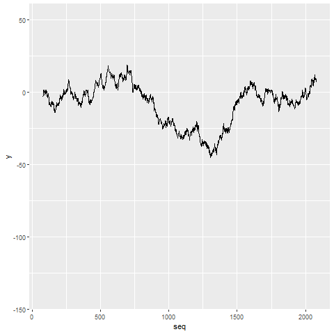

```{r}


```

Here I will add:

-   A animated gif of photoquads at LTER sites through time.


-   a time-series plot displaying changes in coral and algal cover through time.



-   Acoustic data

::: {style="max-width: 500px; margin: 20px auto; text-align: center;"}
<iframe width="100%" height="100" src="https://www.youtube.com/embed/CHM8G_nxi48?controls=1&amp;modestbranding=1&amp;rel=0" frameborder="0" allow="accelerometer; autoplay; clipboard-write; encrypted-media; gyroscope; picture-in-picture" allowfullscreen>

</iframe>
:::
